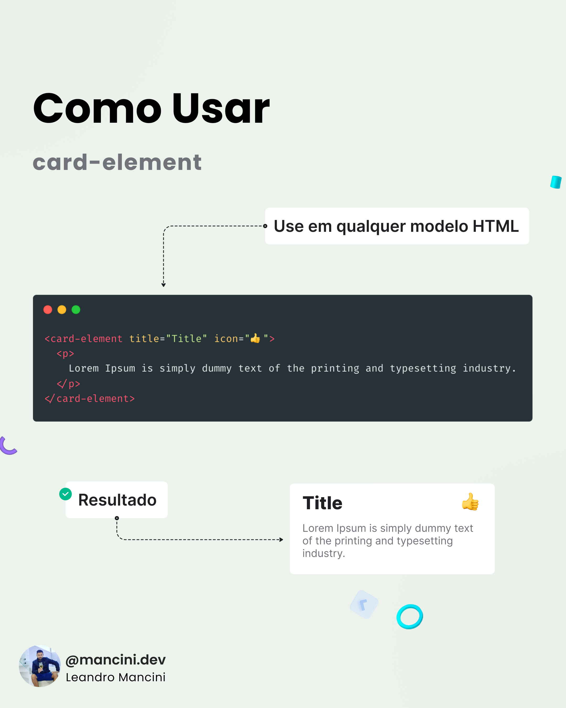
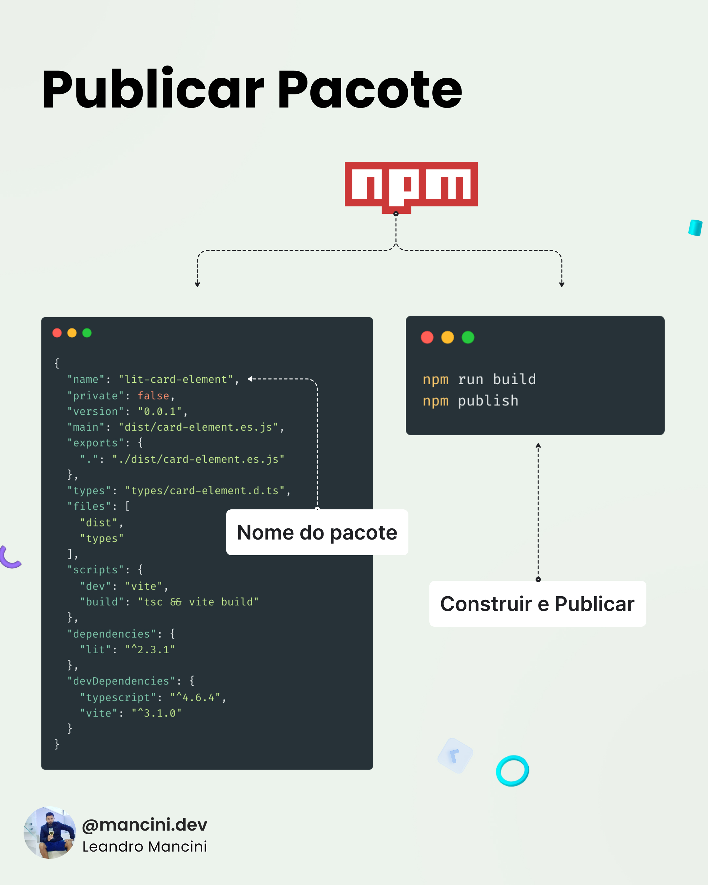
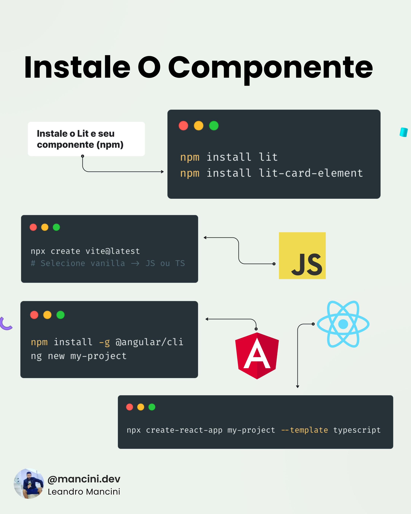
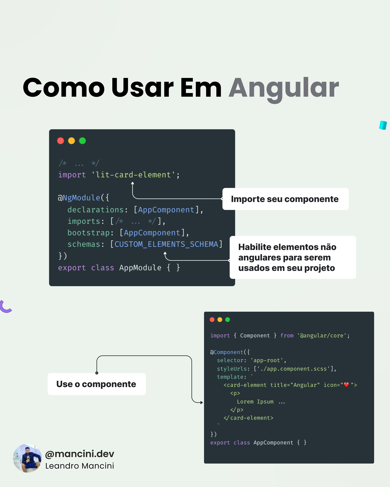

# Crie Web Components usando o Lit

E use-os em todos os lugares

## O que é Lit?

Um framework para criar facilmente componentes web

1. Escreva Web Components usando [Lit](https://lit.dev/)
2. Publique no [npm](https://npmjs.com/)
3. Use em todos os lugares

### Objetivo

Criar o componente card-element com os seguintes recursos

- Título personalizado
- Ícone personalizado
- Conteúdo personalizado `<slot />`

### Começando

Crie um projeto Lit com ViteJS

```bash
npm create vite@latest

# Selecione Lit -> TypeScript

cd my-project-name
npm install
npm run dev
```

> Agora você pode abrir seu projeto Lit em localhost:3000

### Como usar

```html
<card-element title="Card Title" icon="❤️">
    <p>
        Lorem Ipsum is simply dummy text of the printing and typesetting industry.
    </p>
</card-element>
```

### Codigo-fonte

```typescript
import { CSSResultGroup, html, LitElement, TemplateResult } from "lit";
import { customElement, property } from 'lit/decorators.js'
import styles from './card.styles';

@customElement('card-element')
export class CardElement extends LitElement {
    static styles: CSSResultGroup = styles;

    // Propriedades do componente
    @property({ type: String }) title: string = '';
    @property({ type: String }) icon: string = '';

    render(): TemplateResult {
        return html`
            <div class="c-card">
                <h3 class="c-card__title">
                    ${this.title}
                    <span class="c-card__icon">${this.icon}</span>
                </h3>
                <div class="c-card__content">
                    <!-- Renderiza seus filhos -->
                    <slot></slot>
                </div>
            </div>
        `;
    }
}

declare global {
    interface HTMLElementTagNameMap {
        'card-element': CardElement
    }
}
```

### Publicar pacote

```json
{
  "name": "lit-card-element",
  "private": false,
  "version": "0.0.1",
  "main": "dist/card-element.es.js",
  "exports": {
    ".": "./dist/card-element.es.js"
  },
  "types": "types/card-element.d.ts",
  "files": [
    "dist",
    "types"
  ],
  "scripts": {
    "dev": "vite",
    "build": "tsc && vite build"
  },
  "dependencies": {
    "lit": "^2.3.1"
  },
  "devDependencies": {
    "typescript": "^4.6.4",
    "vite": "^3.1.0"
  }
}
```

#### Construir e Publicar

```bash
npm run build
npm publish
```

### Instale o componente

Instale o Lit e seu componente (npm)

```bash
npm install lit
npm install lit-card-element
```

#### VanillaJS

```bash
npx create vite@latest
# Selecione vanilla -> JS ou TS
```

#### Angular

```bash
npm install -g @angular/cli
ng new my-project
```

#### React

```bash
npx create-react-app my-project --template typescript
```

```html
<!DOCTYPE html>
<html lang="en">
  <head>
    <meta charset="UTF-8" />
    <title>Vite + Lit + TS</title>
    <script type="module">
        // Importe seu componente
        import 'lit-card-element'
    </script>
  </head>
  <body>
    <!-- Use o componente -->
    <card-element title="VanillaJS" icon="❤️">
      <p>
        Lorem Ipsum is simply dummy text of the printing and typesetting industry.
      </p>
    </card-element>
  </body>
</html>
```

### Como usar em Angular

```typescript
/* ... */
// Importe seu componente
import 'lit-card-element';

@NgModule({
    declarations: [AppComponent],
    imports: [/* ... */],
    bootstrap: [AppComponent],
    // Habilite elementos não angulares para serem usados em seu projeto
    schemas: [CUSTOM_ELEMENTS_SHEMA]
})
export class AppModule {}
```

Use o componente

```typescript
import { Component } from '@angular/core';

@Component({
  selector: 'app-root',
  styleUrls: ['./app.component.scss'],
  template: `
    <card-element title="Angular" icon="❤️">
        <p>
            Lorem Ipsum is simply dummy text of the printing and typesetting industry.
        </p>
    </card-element>
  `
})
export class AppComponent { }

```

### Como usar no React

Envolva seu componente [Lit](https://lit.dev/) para ser usado no [React](https://pt-br.reactjs.org/)

```typescript
import * as React from "react"
import { createComponent } from "@lit-labs/react"
import Component from "lit-card-element"

export default createComponent(React, "card-element", Component, {})
```

Importe e use o componente no projeto React

```tsx
export function App() {
  return (
    <>
        <CardElement title="Angular" icon="❤️">
            <p>
                Lorem Ipsum is simply dummy text of the printing and typesetting industry.
            </p>
        </CardElement>
    </>
  );
}

export default App;
```

## Tutorial

| Slide 01 | Slide 02 | Slide 03 | Slide 04 | Slide 05 | Slide 06 | Slide 07 | Slide 08 | Slide 09 | Slide 10 | Slide 11 | Slide 12 |
| - | - | - | - | - | - | - | - | - | - | - | - |
|  |  |  |  |  |  |  |  |  |  |  |  |
