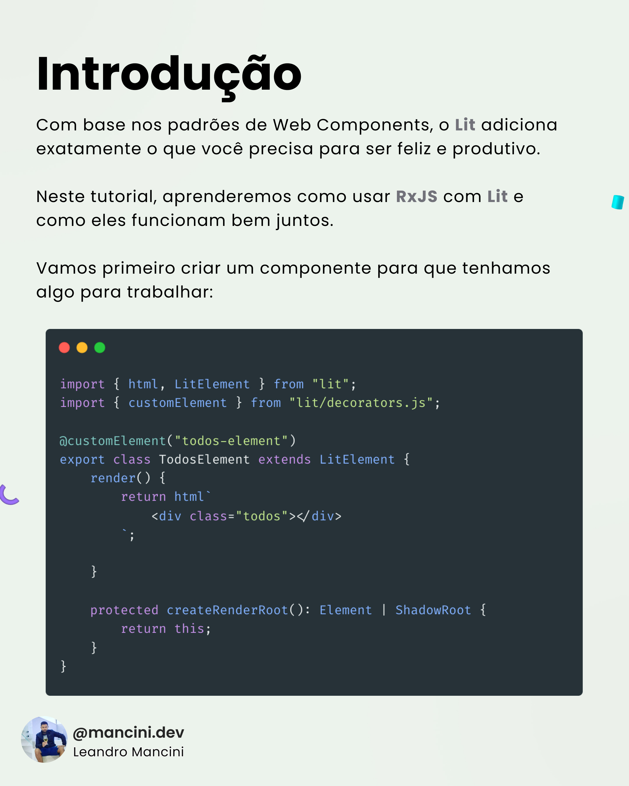
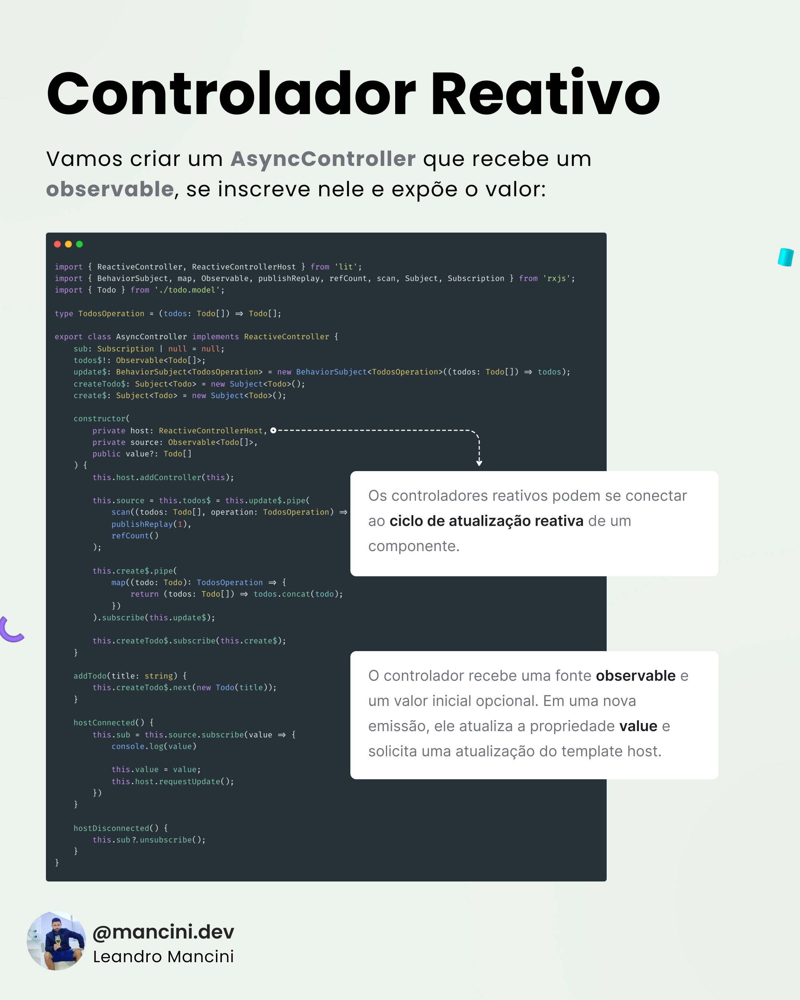
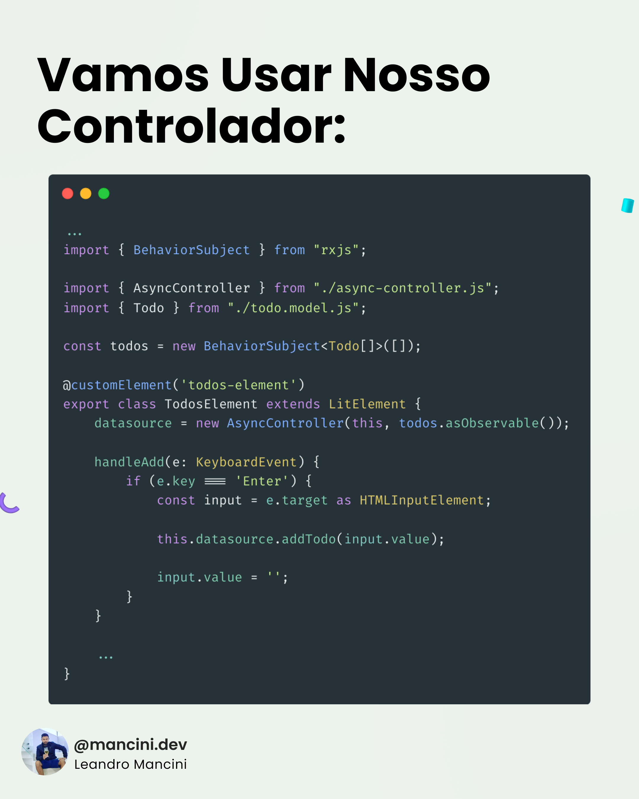
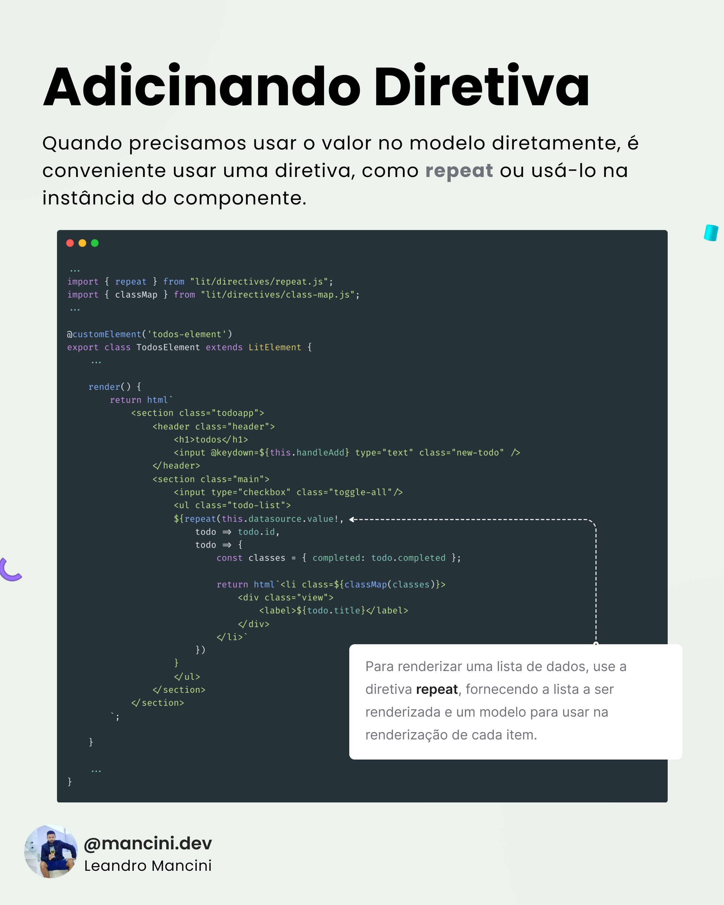

# Lit & RxJS

Feitos um para o outro

Com base nos padrões de Web Components, o [Lit](https://lit.dev/) adiciona exatamente o que você precisa para ser feliz e produtivo.

Neste tutorial, aprenderemos como usar [RxJS](https://rxjs.dev/) com [Lit](https://lit.dev/) e como eles funcionam bem juntos. 

Vamos primeiro criar um componente para que tenhamos algo para trabalhar:

```typescript
import { html, LitElement, TemplateResult } from "lit";
import { customElement } from "lit/decorators.js";

@customElement('todos-element')
export class TodosElement extends LitElement {
    render(): TemplateResult {

        return html`
            <div class="todoapp"></div>
        `;

    }

    protected createRenderRoot(): Element | ShadowRoot {
        return this;
    }
}
```

## Controlador reativo

Vamos criar um `AsyncController` que recebe um `observable`, se inscreve nele e expõe o valor:

```typescript
import { ReactiveController, ReactiveControllerHost } from 'lit';
import { BehaviorSubject, map, Observable, publishReplay, refCount, scan, Subject, Subscription } from 'rxjs';
import { Todo } from './todo.model';

type TodosOperation = (todos: Todo[]) => Todo[];

export class AsyncController implements ReactiveController {
    sub: Subscription | null = null;
    todos$!: Observable<Todo[]>;
    update$: BehaviorSubject<TodosOperation> = new BehaviorSubject<TodosOperation>((todos: Todo[]) => todos);
    createTodo$: Subject<Todo> = new Subject<Todo>();
    create$: Subject<Todo> = new Subject<Todo>();

    constructor(
        private host: ReactiveControllerHost,
        private source: Observable<Todo[]>,
        public value?: Todo[]
    ) {
        this.host.addController(this);

        this.source = this.todos$ = this.update$.pipe(
            scan((todos: Todo[], operation: TodosOperation) => operation(todos), initialTodos),
            publishReplay(1),
            refCount()
        );

        this.create$.pipe(
            map((todo: Todo): TodosOperation => {
                return (todos: Todo[]) => todos.concat(todo);
            })
        ).subscribe(this.update$);

        this.createTodo$.subscribe(this.create$);
    }

    addTodo(title: string): void {
        this.createTodo$.next(new Todo(title));
    }

    hostConnected(): void {
        this.sub = this.source.subscribe(value => {
            this.value = value;
            this.host.requestUpdate();
        })
    }

    hostDisconnected(): void {
        this.sub?.unsubscribe();
    }
}
```

Os controladores reativos podem se conectar ao [ciclo de atualização reativa](https://lit.dev/docs/components/lifecycle/#reactive-update-cycle) de um componente.

O controlador recebe uma fonte `observable` e um valor inicial opcional. Em uma nova emissão, ele atualiza a propriedade `value` e solicita uma atualização do template host.

## Vamos usar nosso controlador:

```typescript
...

import { BehaviorSubject } from "rxjs";

import { AsyncController } from "./async-controller.js";
import { Todo } from "./todo.model.js";

const todos = new BehaviorSubject<Todo[]>([]);

@customElement('todos-element')
export class TodosElement extends LitElement {
    datasource = new AsyncController(this, todos.asObservable());

    handleAdd(event: KeyboardEvent) {
        if (e.key === 'Enter') {
            const input = e.target as HTMLInputElement;
            
            this.datasource.addTodo(input.value);

            input.value = '';
        }
    }

    ...
}
```

## Adicinando diretiva

Quando precisamos usar o valor no modelo diretamente, é conveniente usar uma diretiva, como [repeat](https://lit.dev/docs/templates/directives/#repeat) ou usá-lo na instância do componente.

```typescript
...

import { repeat } from "lit/directives/repeat.js";
import { classMap } from "lit/directives/class-map.js";

...

@customElement('todos-element')
export class TodosElement extends LitElement {
    ...

    render(): TemplateResult {
        return html`
            <section class="todoapp">
                <header class="header">
                    <h1>todos</h1>
                    <input @keydown=${this.handleAdd} type="text" class="new-todo" placeholder="O que precisa ser feito?" #toggleall />
                </header>
                <section class="main">
                    <input type="checkbox" class="toggle-all"/>
                    <ul class="todo-list">
                    ${repeat(this.datasource.value!, 
                        todo => todo.id, 
                        todo => {
                            const classes = { completed: todo.completed };

                            return html`<li class=${classMap(classes)}>
                                <div class="view">
                                    <label>${todo.title}</label>
                                </div>
                            </li>`
                        })
                    }
                    </ul>
                </section>
            </section>
        `;

    }

    ...
}
```

Para renderizar uma lista de dados, use a diretiva [repeat](https://lit.dev/docs/templates/directives/#repeat), fornecendo a lista a ser renderizada e um modelo para usar na renderização de cada item.

## Tutorial

| Slide 01 | Slide 02 | Slide 03 | Slide 04 | Slide 05 | Slide 06 |
| - | - | - | - | - | - |
|  |  |  |  |  |  |